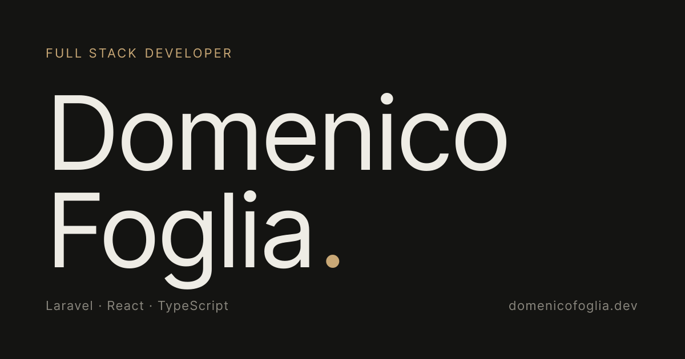

# Portfolio · Domenico Foglia

Portfolio personale, bilingue IT/EN, con dark/light mode.

**Live** → [domenicofoglia.dev](https://domenicofoglia.dev)

## Stack

- **React 19** + **TypeScript** + **Vite** per il frontend
- **react-i18next** per il bilingue
- **CSS Custom Properties** per la palette e il theming (dark/light)
- **Nginx** + **Let's Encrypt** su VPS Hetzner per il deploy

## Struttura del progetto

\`\`\`
src/
├── components/     # Sidebar, Nav, sezioni contenuto
├── content/        # Dati dei progetti
├── hooks/          # useScrollSpy, useTheme
├── i18n/           # Config i18next + traduzioni IT/EN
├── styles/         # CSS globali (layout, reset)
└── App.tsx
\`\`\`

## Development locale

Requisiti: Node 20+, npm.

\`\`\`bash
git clone git@github.com:DomenicoFoglia/portfolio.git
cd portfolio
npm install
npm run dev
\`\`\`

Il sito è disponibile su `http://localhost:5173`.

## Contatti

- Email: [foglia.dmnc@gmail.com](mailto:foglia.dmnc@gmail.com)
- LinkedIn: [linkedin.com/in/domenicofoglia](https://linkedin.com/in/domenicofoglia)
- GitHub: [github.com/DomenicoFoglia](https://github.com/DomenicoFoglia)